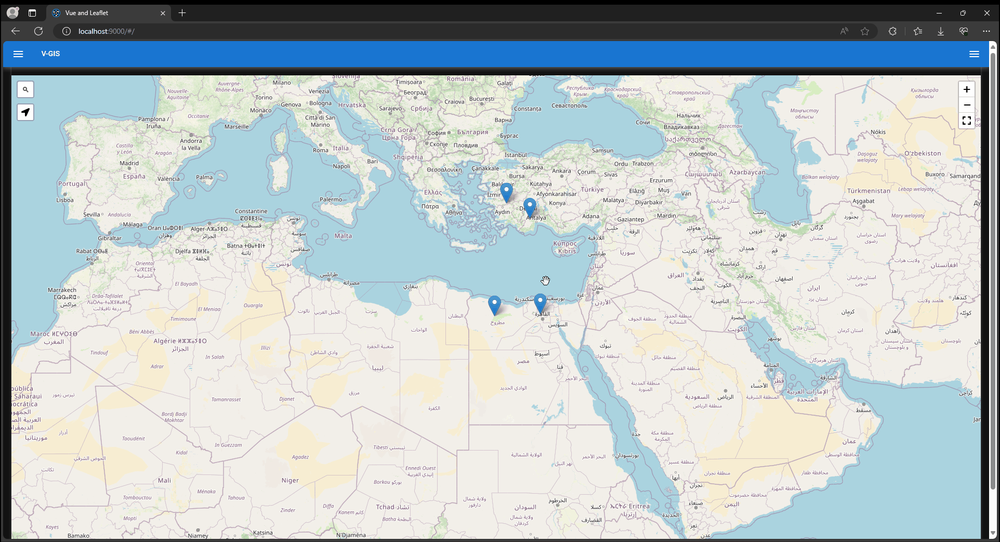

# Vue and Leaflet (vue-and-leaflet)

A Vue GIS app built using Vue, Quasar and Leaflet

* [Vue.js 3](https://vuejs.org/)
* [Quasar Framework](https://quasar.dev/)
* [Pinia](https://pinia.vuejs.org/)
* [VueUse](https://vueuse.org/)
* [Leaflet JS](https://leafletjs.com/)


### Live Preview

[Vue GIS App](https://moustafashaaban.github.io/Vue-GIS/)


###  Project Goals

* Create, Read, Update and Delete (CRUD) geo features.

* Persist features data using the localStorage API.

* Search for features by feature title or description.


### Project Review

* Project Review:


* Adding Data:


* Filtering Data:


* Sort and Update Data:



* Delete Data and Search for new places:


-------------------------------------------------


## Install the dependencies
```bash
yarn
# or
npm install
```

### Start the app in development mode (hot-code reloading, error reporting, etc.)
```bash
quasar dev
```


### Build the app for production
```bash
quasar build
```

### Customize the configuration
See [Configuring quasar.config.js](https://v2.quasar.dev/quasar-cli-vite/quasar-config-js).
